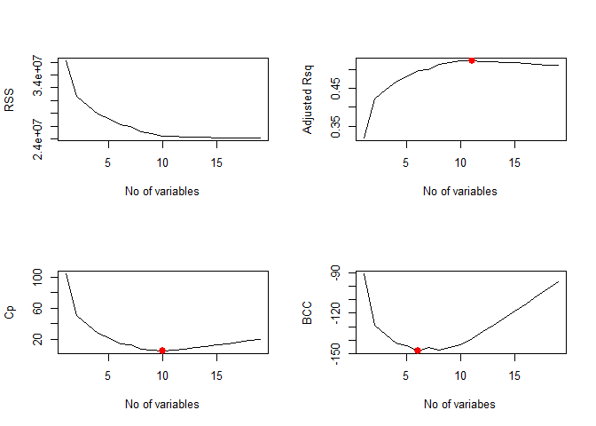
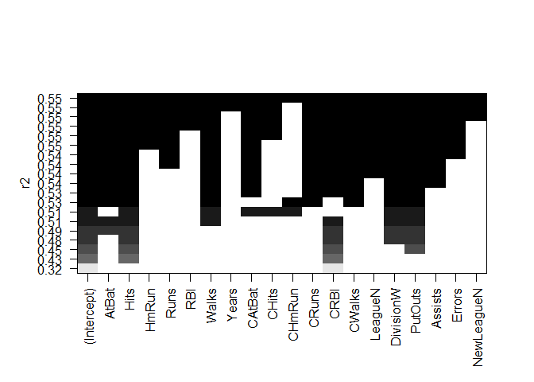
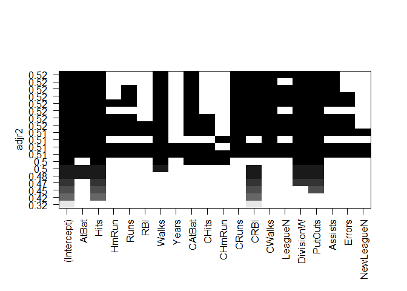

Applying the best subset selection approach to the Hitters data. We wish to predict a baseball player’s Salary on the basis of various statistics associated with performance in the previous year.

``` r
options(warn = -1)
library(ISLR)
names(Hitters)
```

    ##  [1] "AtBat"     "Hits"      "HmRun"     "Runs"      "RBI"      
    ##  [6] "Walks"     "Years"     "CAtBat"    "CHits"     "CHmRun"   
    ## [11] "CRuns"     "CRBI"      "CWalks"    "League"    "Division" 
    ## [16] "PutOuts"   "Assists"   "Errors"    "Salary"    "NewLeague"

``` r
dim(Hitters)
```

    ## [1] 322  20

``` r
sum(is.na(Hitters$Salary))
```

    ## [1] 59

Here `salary` is missing for 59 players. use `na.omit` to remove all the rows that have missing value.

``` r
Hitters = na.omit(Hitters)
dim(Hitters)
```

    ## [1] 263  20

``` r
sum(is.na(Hitters$Salary))
```

    ## [1] 0

The `regsubsets()` function (part of the `leaps` library) performs best subset selection by identifying the best model that contains a given number of predictors, where best is quantified using RSS.

``` r
library(leaps)
regfit.full = regsubsets(Salary ~ .,Hitters)
summary(regfit.full)
```

    ## Subset selection object
    ## Call: regsubsets.formula(Salary ~ ., Hitters)
    ## 19 Variables  (and intercept)
    ##            Forced in Forced out
    ## AtBat          FALSE      FALSE
    ## Hits           FALSE      FALSE
    ## HmRun          FALSE      FALSE
    ## Runs           FALSE      FALSE
    ## RBI            FALSE      FALSE
    ## Walks          FALSE      FALSE
    ## Years          FALSE      FALSE
    ## CAtBat         FALSE      FALSE
    ## CHits          FALSE      FALSE
    ## CHmRun         FALSE      FALSE
    ## CRuns          FALSE      FALSE
    ## CRBI           FALSE      FALSE
    ## CWalks         FALSE      FALSE
    ## LeagueN        FALSE      FALSE
    ## DivisionW      FALSE      FALSE
    ## PutOuts        FALSE      FALSE
    ## Assists        FALSE      FALSE
    ## Errors         FALSE      FALSE
    ## NewLeagueN     FALSE      FALSE
    ## 1 subsets of each size up to 8
    ## Selection Algorithm: exhaustive
    ##          AtBat Hits HmRun Runs RBI Walks Years CAtBat CHits CHmRun CRuns
    ## 1  ( 1 ) " "   " "  " "   " "  " " " "   " "   " "    " "   " "    " "  
    ## 2  ( 1 ) " "   "*"  " "   " "  " " " "   " "   " "    " "   " "    " "  
    ## 3  ( 1 ) " "   "*"  " "   " "  " " " "   " "   " "    " "   " "    " "  
    ## 4  ( 1 ) " "   "*"  " "   " "  " " " "   " "   " "    " "   " "    " "  
    ## 5  ( 1 ) "*"   "*"  " "   " "  " " " "   " "   " "    " "   " "    " "  
    ## 6  ( 1 ) "*"   "*"  " "   " "  " " "*"   " "   " "    " "   " "    " "  
    ## 7  ( 1 ) " "   "*"  " "   " "  " " "*"   " "   "*"    "*"   "*"    " "  
    ## 8  ( 1 ) "*"   "*"  " "   " "  " " "*"   " "   " "    " "   "*"    "*"  
    ##          CRBI CWalks LeagueN DivisionW PutOuts Assists Errors NewLeagueN
    ## 1  ( 1 ) "*"  " "    " "     " "       " "     " "     " "    " "       
    ## 2  ( 1 ) "*"  " "    " "     " "       " "     " "     " "    " "       
    ## 3  ( 1 ) "*"  " "    " "     " "       "*"     " "     " "    " "       
    ## 4  ( 1 ) "*"  " "    " "     "*"       "*"     " "     " "    " "       
    ## 5  ( 1 ) "*"  " "    " "     "*"       "*"     " "     " "    " "       
    ## 6  ( 1 ) "*"  " "    " "     "*"       "*"     " "     " "    " "       
    ## 7  ( 1 ) " "  " "    " "     "*"       "*"     " "     " "    " "       
    ## 8  ( 1 ) " "  "*"    " "     "*"       "*"     " "     " "    " "

An asterisk indicates that given variable is included in model. For ex best two-variable model contains only `Hits` and `CRBI`

By default `regsubsets` only reports variable upto 8 variable model. use `nvmax` to return as many variables as desired.

``` r
regfit.full = regsubsets(Salary ~ ., Hitters, nvmax = 19)
reg.summary = summary(regfit.full)
```

R2 statistic

``` r
reg.summary$rsq
```

    ##  [1] 0.3214501 0.4252237 0.4514294 0.4754067 0.4908036 0.5087146 0.5141227
    ##  [8] 0.5285569 0.5346124 0.5404950 0.5426153 0.5436302 0.5444570 0.5452164
    ## [15] 0.5454692 0.5457656 0.5459518 0.5460945 0.5461159

R2 statistic increases from 32% when only one variable included to almost 55% when all the variables are included.

Plotting RSS, adjusted R2, Cp, and BIC for all of the models at once will help us decide which model to select.

``` r
par(mfrow = c(2,2))
plot(reg.summary$rss, xlab = "No of variables", ylab = "RSS", type="l")  #type="l"  to connect the plotted points with lines.

plot(reg.summary$adjr2, xlab = "No of variables", ylab = "Adjusted Rsq", type="l")
#which.max(reg.summary$adjr2) location of max point in vector => 11
points(11, reg.summary$adjr2[11], col = 'red', cex = 2, pch = 20)

plot(reg.summary$cp, xlab = "No of variables", ylab = "Cp", type = 'l')
#which.min(reg.summary$cp ) => 10
points(10, reg.summary$cp[10], col = "red", cex = 2, pch = 20)

plot(reg.summary$bic, xlab = "No of variabes", ylab = "BCC", type = 'l')
#which.min(reg.summary$bic ) => 6
points(6, reg.summary$bic[6], col = "red", cex = 2, pch = 20)
```



``` r
plot(regfit.full ,scale="r2")
```



``` r
plot(regfit.full ,scale="adjr2")
```



``` r
plot(regfit.full ,scale="Cp")
```


``` r
plot(regfit.full ,scale="bic")
```


the modelwith lowest BIC contains 6 variables. to find coeficients,

``` r
coef(regfit.full, 6)
```

    ##  (Intercept)        AtBat         Hits        Walks         CRBI 
    ##   91.5117981   -1.8685892    7.6043976    3.6976468    0.6430169 
    ##    DivisionW      PutOuts 
    ## -122.9515338    0.2643076

------------------------------------------------------------------------

Forward and Backward Stepwise Selection

------------------------------------------------------------------------

``` r
regfit.fwd = regsubsets(Salary ~ ., data = Hitters, nvmax = 19, method = "forward")
summary(regfit.fwd)
```

    ## Subset selection object
    ## Call: regsubsets.formula(Salary ~ ., data = Hitters, nvmax = 19, method = "forward")
    ## 19 Variables  (and intercept)
    ##            Forced in Forced out
    ## AtBat          FALSE      FALSE
    ## Hits           FALSE      FALSE
    ## HmRun          FALSE      FALSE
    ## Runs           FALSE      FALSE
    ## RBI            FALSE      FALSE
    ## Walks          FALSE      FALSE
    ## Years          FALSE      FALSE
    ## CAtBat         FALSE      FALSE
    ## CHits          FALSE      FALSE
    ## CHmRun         FALSE      FALSE
    ## CRuns          FALSE      FALSE
    ## CRBI           FALSE      FALSE
    ## CWalks         FALSE      FALSE
    ## LeagueN        FALSE      FALSE
    ## DivisionW      FALSE      FALSE
    ## PutOuts        FALSE      FALSE
    ## Assists        FALSE      FALSE
    ## Errors         FALSE      FALSE
    ## NewLeagueN     FALSE      FALSE
    ## 1 subsets of each size up to 19
    ## Selection Algorithm: forward
    ##           AtBat Hits HmRun Runs RBI Walks Years CAtBat CHits CHmRun CRuns
    ## 1  ( 1 )  " "   " "  " "   " "  " " " "   " "   " "    " "   " "    " "  
    ## 2  ( 1 )  " "   "*"  " "   " "  " " " "   " "   " "    " "   " "    " "  
    ## 3  ( 1 )  " "   "*"  " "   " "  " " " "   " "   " "    " "   " "    " "  
    ## 4  ( 1 )  " "   "*"  " "   " "  " " " "   " "   " "    " "   " "    " "  
    ## 5  ( 1 )  "*"   "*"  " "   " "  " " " "   " "   " "    " "   " "    " "  
    ## 6  ( 1 )  "*"   "*"  " "   " "  " " "*"   " "   " "    " "   " "    " "  
    ## 7  ( 1 )  "*"   "*"  " "   " "  " " "*"   " "   " "    " "   " "    " "  
    ## 8  ( 1 )  "*"   "*"  " "   " "  " " "*"   " "   " "    " "   " "    "*"  
    ## 9  ( 1 )  "*"   "*"  " "   " "  " " "*"   " "   "*"    " "   " "    "*"  
    ## 10  ( 1 ) "*"   "*"  " "   " "  " " "*"   " "   "*"    " "   " "    "*"  
    ## 11  ( 1 ) "*"   "*"  " "   " "  " " "*"   " "   "*"    " "   " "    "*"  
    ## 12  ( 1 ) "*"   "*"  " "   "*"  " " "*"   " "   "*"    " "   " "    "*"  
    ## 13  ( 1 ) "*"   "*"  " "   "*"  " " "*"   " "   "*"    " "   " "    "*"  
    ## 14  ( 1 ) "*"   "*"  "*"   "*"  " " "*"   " "   "*"    " "   " "    "*"  
    ## 15  ( 1 ) "*"   "*"  "*"   "*"  " " "*"   " "   "*"    "*"   " "    "*"  
    ## 16  ( 1 ) "*"   "*"  "*"   "*"  "*" "*"   " "   "*"    "*"   " "    "*"  
    ## 17  ( 1 ) "*"   "*"  "*"   "*"  "*" "*"   " "   "*"    "*"   " "    "*"  
    ## 18  ( 1 ) "*"   "*"  "*"   "*"  "*" "*"   "*"   "*"    "*"   " "    "*"  
    ## 19  ( 1 ) "*"   "*"  "*"   "*"  "*" "*"   "*"   "*"    "*"   "*"    "*"  
    ##           CRBI CWalks LeagueN DivisionW PutOuts Assists Errors NewLeagueN
    ## 1  ( 1 )  "*"  " "    " "     " "       " "     " "     " "    " "       
    ## 2  ( 1 )  "*"  " "    " "     " "       " "     " "     " "    " "       
    ## 3  ( 1 )  "*"  " "    " "     " "       "*"     " "     " "    " "       
    ## 4  ( 1 )  "*"  " "    " "     "*"       "*"     " "     " "    " "       
    ## 5  ( 1 )  "*"  " "    " "     "*"       "*"     " "     " "    " "       
    ## 6  ( 1 )  "*"  " "    " "     "*"       "*"     " "     " "    " "       
    ## 7  ( 1 )  "*"  "*"    " "     "*"       "*"     " "     " "    " "       
    ## 8  ( 1 )  "*"  "*"    " "     "*"       "*"     " "     " "    " "       
    ## 9  ( 1 )  "*"  "*"    " "     "*"       "*"     " "     " "    " "       
    ## 10  ( 1 ) "*"  "*"    " "     "*"       "*"     "*"     " "    " "       
    ## 11  ( 1 ) "*"  "*"    "*"     "*"       "*"     "*"     " "    " "       
    ## 12  ( 1 ) "*"  "*"    "*"     "*"       "*"     "*"     " "    " "       
    ## 13  ( 1 ) "*"  "*"    "*"     "*"       "*"     "*"     "*"    " "       
    ## 14  ( 1 ) "*"  "*"    "*"     "*"       "*"     "*"     "*"    " "       
    ## 15  ( 1 ) "*"  "*"    "*"     "*"       "*"     "*"     "*"    " "       
    ## 16  ( 1 ) "*"  "*"    "*"     "*"       "*"     "*"     "*"    " "       
    ## 17  ( 1 ) "*"  "*"    "*"     "*"       "*"     "*"     "*"    "*"       
    ## 18  ( 1 ) "*"  "*"    "*"     "*"       "*"     "*"     "*"    "*"       
    ## 19  ( 1 ) "*"  "*"    "*"     "*"       "*"     "*"     "*"    "*"

``` r
regfit.bwd = regsubsets(Salary ~ ., data = Hitters, nvmax = 19, method = "backward")
summary(regfit.bwd)
```

    ## Subset selection object
    ## Call: regsubsets.formula(Salary ~ ., data = Hitters, nvmax = 19, method = "backward")
    ## 19 Variables  (and intercept)
    ##            Forced in Forced out
    ## AtBat          FALSE      FALSE
    ## Hits           FALSE      FALSE
    ## HmRun          FALSE      FALSE
    ## Runs           FALSE      FALSE
    ## RBI            FALSE      FALSE
    ## Walks          FALSE      FALSE
    ## Years          FALSE      FALSE
    ## CAtBat         FALSE      FALSE
    ## CHits          FALSE      FALSE
    ## CHmRun         FALSE      FALSE
    ## CRuns          FALSE      FALSE
    ## CRBI           FALSE      FALSE
    ## CWalks         FALSE      FALSE
    ## LeagueN        FALSE      FALSE
    ## DivisionW      FALSE      FALSE
    ## PutOuts        FALSE      FALSE
    ## Assists        FALSE      FALSE
    ## Errors         FALSE      FALSE
    ## NewLeagueN     FALSE      FALSE
    ## 1 subsets of each size up to 19
    ## Selection Algorithm: backward
    ##           AtBat Hits HmRun Runs RBI Walks Years CAtBat CHits CHmRun CRuns
    ## 1  ( 1 )  " "   " "  " "   " "  " " " "   " "   " "    " "   " "    "*"  
    ## 2  ( 1 )  " "   "*"  " "   " "  " " " "   " "   " "    " "   " "    "*"  
    ## 3  ( 1 )  " "   "*"  " "   " "  " " " "   " "   " "    " "   " "    "*"  
    ## 4  ( 1 )  "*"   "*"  " "   " "  " " " "   " "   " "    " "   " "    "*"  
    ## 5  ( 1 )  "*"   "*"  " "   " "  " " "*"   " "   " "    " "   " "    "*"  
    ## 6  ( 1 )  "*"   "*"  " "   " "  " " "*"   " "   " "    " "   " "    "*"  
    ## 7  ( 1 )  "*"   "*"  " "   " "  " " "*"   " "   " "    " "   " "    "*"  
    ## 8  ( 1 )  "*"   "*"  " "   " "  " " "*"   " "   " "    " "   " "    "*"  
    ## 9  ( 1 )  "*"   "*"  " "   " "  " " "*"   " "   "*"    " "   " "    "*"  
    ## 10  ( 1 ) "*"   "*"  " "   " "  " " "*"   " "   "*"    " "   " "    "*"  
    ## 11  ( 1 ) "*"   "*"  " "   " "  " " "*"   " "   "*"    " "   " "    "*"  
    ## 12  ( 1 ) "*"   "*"  " "   "*"  " " "*"   " "   "*"    " "   " "    "*"  
    ## 13  ( 1 ) "*"   "*"  " "   "*"  " " "*"   " "   "*"    " "   " "    "*"  
    ## 14  ( 1 ) "*"   "*"  "*"   "*"  " " "*"   " "   "*"    " "   " "    "*"  
    ## 15  ( 1 ) "*"   "*"  "*"   "*"  " " "*"   " "   "*"    "*"   " "    "*"  
    ## 16  ( 1 ) "*"   "*"  "*"   "*"  "*" "*"   " "   "*"    "*"   " "    "*"  
    ## 17  ( 1 ) "*"   "*"  "*"   "*"  "*" "*"   " "   "*"    "*"   " "    "*"  
    ## 18  ( 1 ) "*"   "*"  "*"   "*"  "*" "*"   "*"   "*"    "*"   " "    "*"  
    ## 19  ( 1 ) "*"   "*"  "*"   "*"  "*" "*"   "*"   "*"    "*"   "*"    "*"  
    ##           CRBI CWalks LeagueN DivisionW PutOuts Assists Errors NewLeagueN
    ## 1  ( 1 )  " "  " "    " "     " "       " "     " "     " "    " "       
    ## 2  ( 1 )  " "  " "    " "     " "       " "     " "     " "    " "       
    ## 3  ( 1 )  " "  " "    " "     " "       "*"     " "     " "    " "       
    ## 4  ( 1 )  " "  " "    " "     " "       "*"     " "     " "    " "       
    ## 5  ( 1 )  " "  " "    " "     " "       "*"     " "     " "    " "       
    ## 6  ( 1 )  " "  " "    " "     "*"       "*"     " "     " "    " "       
    ## 7  ( 1 )  " "  "*"    " "     "*"       "*"     " "     " "    " "       
    ## 8  ( 1 )  "*"  "*"    " "     "*"       "*"     " "     " "    " "       
    ## 9  ( 1 )  "*"  "*"    " "     "*"       "*"     " "     " "    " "       
    ## 10  ( 1 ) "*"  "*"    " "     "*"       "*"     "*"     " "    " "       
    ## 11  ( 1 ) "*"  "*"    "*"     "*"       "*"     "*"     " "    " "       
    ## 12  ( 1 ) "*"  "*"    "*"     "*"       "*"     "*"     " "    " "       
    ## 13  ( 1 ) "*"  "*"    "*"     "*"       "*"     "*"     "*"    " "       
    ## 14  ( 1 ) "*"  "*"    "*"     "*"       "*"     "*"     "*"    " "       
    ## 15  ( 1 ) "*"  "*"    "*"     "*"       "*"     "*"     "*"    " "       
    ## 16  ( 1 ) "*"  "*"    "*"     "*"       "*"     "*"     "*"    " "       
    ## 17  ( 1 ) "*"  "*"    "*"     "*"       "*"     "*"     "*"    "*"       
    ## 18  ( 1 ) "*"  "*"    "*"     "*"       "*"     "*"     "*"    "*"       
    ## 19  ( 1 ) "*"  "*"    "*"     "*"       "*"     "*"     "*"    "*"

we see that using forward stepwise selection, the best one variable model contains only `CRBI`, and the best two-variable model additionally includes `Hits`. For this data, the best one-variable through six variable models are each identical for best subset and forward selection. However, the best seven-variable models identified by forward stepwise selection, backward stepwise selection, and best subset selection are different.

``` r
coef(regfit.full, 7)
```

    ##  (Intercept)         Hits        Walks       CAtBat        CHits 
    ##   79.4509472    1.2833513    3.2274264   -0.3752350    1.4957073 
    ##       CHmRun    DivisionW      PutOuts 
    ##    1.4420538 -129.9866432    0.2366813

``` r
coef(regfit.fwd, 7)
```

    ##  (Intercept)        AtBat         Hits        Walks         CRBI 
    ##  109.7873062   -1.9588851    7.4498772    4.9131401    0.8537622 
    ##       CWalks    DivisionW      PutOuts 
    ##   -0.3053070 -127.1223928    0.2533404

``` r
coef(regfit.bwd, 7)
```

    ##  (Intercept)        AtBat         Hits        Walks        CRuns 
    ##  105.6487488   -1.9762838    6.7574914    6.0558691    1.1293095 
    ##       CWalks    DivisionW      PutOuts 
    ##   -0.7163346 -116.1692169    0.3028847
