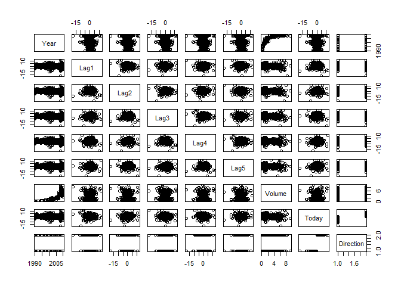

``` r
options(warn = -1)
library(ISLR)
summary(Weekly)
```

    ##       Year           Lag1               Lag2               Lag3         
    ##  Min.   :1990   Min.   :-18.1950   Min.   :-18.1950   Min.   :-18.1950  
    ##  1st Qu.:1995   1st Qu.: -1.1540   1st Qu.: -1.1540   1st Qu.: -1.1580  
    ##  Median :2000   Median :  0.2410   Median :  0.2410   Median :  0.2410  
    ##  Mean   :2000   Mean   :  0.1506   Mean   :  0.1511   Mean   :  0.1472  
    ##  3rd Qu.:2005   3rd Qu.:  1.4050   3rd Qu.:  1.4090   3rd Qu.:  1.4090  
    ##  Max.   :2010   Max.   : 12.0260   Max.   : 12.0260   Max.   : 12.0260  
    ##       Lag4               Lag5              Volume       
    ##  Min.   :-18.1950   Min.   :-18.1950   Min.   :0.08747  
    ##  1st Qu.: -1.1580   1st Qu.: -1.1660   1st Qu.:0.33202  
    ##  Median :  0.2380   Median :  0.2340   Median :1.00268  
    ##  Mean   :  0.1458   Mean   :  0.1399   Mean   :1.57462  
    ##  3rd Qu.:  1.4090   3rd Qu.:  1.4050   3rd Qu.:2.05373  
    ##  Max.   : 12.0260   Max.   : 12.0260   Max.   :9.32821  
    ##      Today          Direction 
    ##  Min.   :-18.1950   Down:484  
    ##  1st Qu.: -1.1540   Up  :605  
    ##  Median :  0.2410             
    ##  Mean   :  0.1499             
    ##  3rd Qu.:  1.4050             
    ##  Max.   : 12.0260

``` r
plot(Weekly)
```



checking corealationship between variables. Excluding `Direction` which is qualitative. It appears only `Year` and `Volume` have relationship.

``` r
cor(Weekly[, -9])
```

    ##               Year         Lag1        Lag2        Lag3         Lag4
    ## Year    1.00000000 -0.032289274 -0.03339001 -0.03000649 -0.031127923
    ## Lag1   -0.03228927  1.000000000 -0.07485305  0.05863568 -0.071273876
    ## Lag2   -0.03339001 -0.074853051  1.00000000 -0.07572091  0.058381535
    ## Lag3   -0.03000649  0.058635682 -0.07572091  1.00000000 -0.075395865
    ## Lag4   -0.03112792 -0.071273876  0.05838153 -0.07539587  1.000000000
    ## Lag5   -0.03051910 -0.008183096 -0.07249948  0.06065717 -0.075675027
    ## Volume  0.84194162 -0.064951313 -0.08551314 -0.06928771 -0.061074617
    ## Today  -0.03245989 -0.075031842  0.05916672 -0.07124364 -0.007825873
    ##                Lag5      Volume        Today
    ## Year   -0.030519101  0.84194162 -0.032459894
    ## Lag1   -0.008183096 -0.06495131 -0.075031842
    ## Lag2   -0.072499482 -0.08551314  0.059166717
    ## Lag3    0.060657175 -0.06928771 -0.071243639
    ## Lag4   -0.075675027 -0.06107462 -0.007825873
    ## Lag5    1.000000000 -0.05851741  0.011012698
    ## Volume -0.058517414  1.00000000 -0.033077783
    ## Today   0.011012698 -0.03307778  1.000000000

``` r
attach(Weekly)
glm_fit = glm(Direction ~ Lag1 + Lag2 + Lag3 + Lag4 + Lag5 + Volume, data = Weekly, family = binomial)
summary(glm_fit)
```

    ## 
    ## Call:
    ## glm(formula = Direction ~ Lag1 + Lag2 + Lag3 + Lag4 + Lag5 + 
    ##     Volume, family = binomial, data = Weekly)
    ## 
    ## Deviance Residuals: 
    ##     Min       1Q   Median       3Q      Max  
    ## -1.6949  -1.2565   0.9913   1.0849   1.4579  
    ## 
    ## Coefficients:
    ##             Estimate Std. Error z value Pr(>|z|)   
    ## (Intercept)  0.26686    0.08593   3.106   0.0019 **
    ## Lag1        -0.04127    0.02641  -1.563   0.1181   
    ## Lag2         0.05844    0.02686   2.175   0.0296 * 
    ## Lag3        -0.01606    0.02666  -0.602   0.5469   
    ## Lag4        -0.02779    0.02646  -1.050   0.2937   
    ## Lag5        -0.01447    0.02638  -0.549   0.5833   
    ## Volume      -0.02274    0.03690  -0.616   0.5377   
    ## ---
    ## Signif. codes:  0 '***' 0.001 '**' 0.01 '*' 0.05 '.' 0.1 ' ' 1
    ## 
    ## (Dispersion parameter for binomial family taken to be 1)
    ## 
    ##     Null deviance: 1496.2  on 1088  degrees of freedom
    ## Residual deviance: 1486.4  on 1082  degrees of freedom
    ## AIC: 1500.4
    ## 
    ## Number of Fisher Scoring iterations: 4

It appears only `Lag2` have some statistical significance.

Now using predict function we can get the probablities. Then we use threshold as 0.5 to predict `Up` and `Down`

``` r
glm_probs = predict(glm_fit, type = "response")
glm_pred = rep("Down", length(glm_probs))
glm_pred[glm_probs > 0.5] = "Up"
table(glm_pred, Direction)
```

    ##         Direction
    ## glm_pred Down  Up
    ##     Down   54  48
    ##     Up    430 557

Percentage of currect predictions: (54+557)/(54+557+48+430) = 56.1%. Weeks the market goes up the logistic regression is right most of the time, 557/(557+48) = 92.1%. Weeks the market goes up the logistic regression is wrong most of the time 54/(430+54) = 11.2%.

Now we'll fit the trainning data period from 1990 to 2008 using `Lag2` only.

``` r
train = (Year < 2009)
weekly_testing = Weekly[!train,]
direction_testing = Direction[!train]
glm_fit = glm(Direction ~ Lag2, data = Weekly, family = binomial, subset = train)
glm_probs = predict(glm_fit, weekly_testing, type = "response")
glm_pred = rep("Down", length(glm_probs))
glm_pred[glm_probs > 0.5] = "Up"
table(glm_pred, direction_testing)
```

    ##         direction_testing
    ## glm_pred Down Up
    ##     Down    9  5
    ##     Up     34 56

``` r
mean(glm_pred == direction_testing)
```

    ## [1] 0.625

Fitting LDA model.

``` r
library(MASS)
lda_fit = lda(Direction ~ Lag2, data = Weekly, subset = train)
lda_pred = predict(lda_fit, weekly_testing)
table(lda_pred$class, direction_testing)
```

    ##       direction_testing
    ##        Down Up
    ##   Down    9  5
    ##   Up     34 56

``` r
mean(lda_pred$class == direction_testing)
```

    ## [1] 0.625
