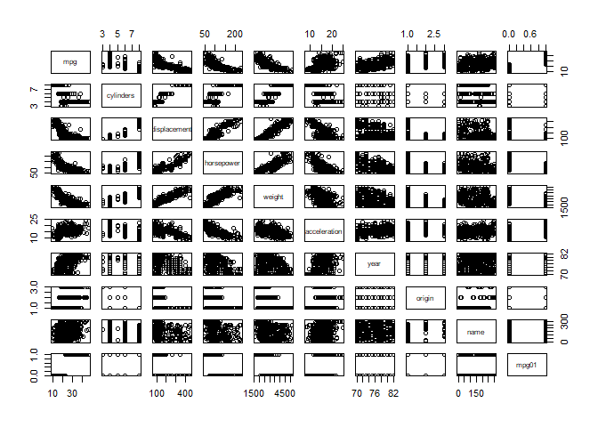

``` r
options(warn = -1)
library(ISLR)
summary(Auto)
```

    ##       mpg          cylinders      displacement     horsepower   
    ##  Min.   : 9.00   Min.   :3.000   Min.   : 68.0   Min.   : 46.0  
    ##  1st Qu.:17.00   1st Qu.:4.000   1st Qu.:105.0   1st Qu.: 75.0  
    ##  Median :22.75   Median :4.000   Median :151.0   Median : 93.5  
    ##  Mean   :23.45   Mean   :5.472   Mean   :194.4   Mean   :104.5  
    ##  3rd Qu.:29.00   3rd Qu.:8.000   3rd Qu.:275.8   3rd Qu.:126.0  
    ##  Max.   :46.60   Max.   :8.000   Max.   :455.0   Max.   :230.0  
    ##                                                                 
    ##      weight      acceleration        year           origin     
    ##  Min.   :1613   Min.   : 8.00   Min.   :70.00   Min.   :1.000  
    ##  1st Qu.:2225   1st Qu.:13.78   1st Qu.:73.00   1st Qu.:1.000  
    ##  Median :2804   Median :15.50   Median :76.00   Median :1.000  
    ##  Mean   :2978   Mean   :15.54   Mean   :75.98   Mean   :1.577  
    ##  3rd Qu.:3615   3rd Qu.:17.02   3rd Qu.:79.00   3rd Qu.:2.000  
    ##  Max.   :5140   Max.   :24.80   Max.   :82.00   Max.   :3.000  
    ##                                                                
    ##                  name    
    ##  amc matador       :  5  
    ##  ford pinto        :  5  
    ##  toyota corolla    :  5  
    ##  amc gremlin       :  4  
    ##  amc hornet        :  4  
    ##  chevrolet chevette:  4  
    ##  (Other)           :365

``` r
attach(Auto)
mpg01 = rep(0, length(mpg))
mpg01[ mpg > median(mpg)] = 1
Auto = data.frame(Auto, mpg01)
```

``` r
cor(Auto[, -9])
```

    ##                     mpg  cylinders displacement horsepower     weight
    ## mpg           1.0000000 -0.7776175   -0.8051269 -0.7784268 -0.8322442
    ## cylinders    -0.7776175  1.0000000    0.9508233  0.8429834  0.8975273
    ## displacement -0.8051269  0.9508233    1.0000000  0.8972570  0.9329944
    ## horsepower   -0.7784268  0.8429834    0.8972570  1.0000000  0.8645377
    ## weight       -0.8322442  0.8975273    0.9329944  0.8645377  1.0000000
    ## acceleration  0.4233285 -0.5046834   -0.5438005 -0.6891955 -0.4168392
    ## year          0.5805410 -0.3456474   -0.3698552 -0.4163615 -0.3091199
    ## origin        0.5652088 -0.5689316   -0.6145351 -0.4551715 -0.5850054
    ## mpg01         0.8369392 -0.7591939   -0.7534766 -0.6670526 -0.7577566
    ##              acceleration       year     origin      mpg01
    ## mpg             0.4233285  0.5805410  0.5652088  0.8369392
    ## cylinders      -0.5046834 -0.3456474 -0.5689316 -0.7591939
    ## displacement   -0.5438005 -0.3698552 -0.6145351 -0.7534766
    ## horsepower     -0.6891955 -0.4163615 -0.4551715 -0.6670526
    ## weight         -0.4168392 -0.3091199 -0.5850054 -0.7577566
    ## acceleration    1.0000000  0.2903161  0.2127458  0.3468215
    ## year            0.2903161  1.0000000  0.1815277  0.4299042
    ## origin          0.2127458  0.1815277  1.0000000  0.5136984
    ## mpg01           0.3468215  0.4299042  0.5136984  1.0000000

``` r
pairs(Auto)
```



Anti-correlated with cylinders, weight, displacement, horsepower.

Split data into training and testing.

``` r
train = (year %% 2 == 0) #splitting even years
test = !train
auto_training = Auto[train, ]
auto_testing = Auto[test, ]
mpg01_test = mpg01[test]
```

LDA using variables most associated with `mpg01`. Using corelation matrix.

``` r
library(MASS)
lda_fit = lda(mpg01 ~ cylinders + weight + displacement + horsepower, data = auto_training)
lda_pred = predict(lda_fit, auto_testing)
mean(lda_pred$class != mpg01_test)
```

    ## [1] 0.1263736

LDA gives error rate of 12.7%

Now, QDA

``` r
qda_fit = qda(mpg01 ~ cylinders + weight + displacement + horsepower, data = auto_training)
qda_pred = predict(qda_fit, auto_testing)
mean(qda_pred$class != mpg01_test)
```

    ## [1] 0.1318681

QDA gives error rate of 13.1%

Now, Logistic regression

``` r
glm_fit = glm(mpg01 ~ cylinders + weight + displacement + horsepower, data = auto_training, family = binomial)
glm_probs = predict(glm_fit, auto_testing)
glm_pred = rep(0, length(glm_probs))
glm_pred[glm_probs > 0.5] = 1
mean(glm_pred != mpg01_test)
```

    ## [1] 0.1263736

Logistic regression gives error rate of 12.6%

KNN

``` r
library(class)
training_data = cbind(cylinders, weight, displacement, horsepower)[train,]
testing_data = cbind(cylinders, weight, displacement, horsepower)[test,]
mpg01_train = mpg01[train]
set.seed(1)

knn_pred = knn(train = training_data, test = testing_data, cl = mpg01_train, k = 1)
mean(knn_pred != mpg01_test)
```

    ## [1] 0.1538462

``` r
knn_pred = knn(train = training_data, test = testing_data, cl = mpg01_train, k = 10)
mean(knn_pred != mpg01_test)
```

    ## [1] 0.1648352

``` r
knn_pred = knn(train = training_data, test = testing_data, cl = mpg01_train, k = 100)
mean(knn_pred != mpg01_test)
```

    ## [1] 0.1428571

K value Error rate 1 15.3% 10 16.4% 100 14.2%

At k = 100 we get minimal error rate.
