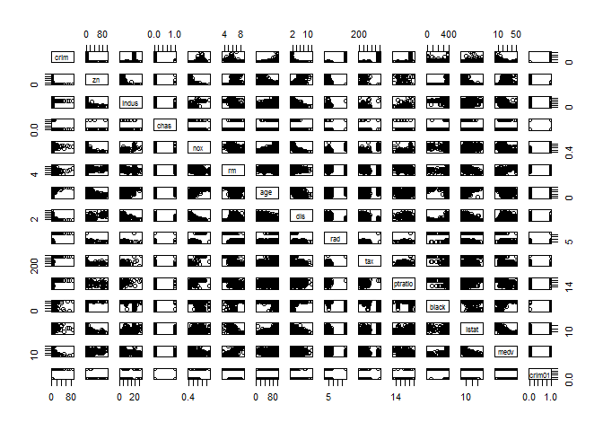

``` r
options(warn = -1)
library(MASS)
summary(Boston)
```

    ##       crim                zn             indus            chas        
    ##  Min.   : 0.00632   Min.   :  0.00   Min.   : 0.46   Min.   :0.00000  
    ##  1st Qu.: 0.08204   1st Qu.:  0.00   1st Qu.: 5.19   1st Qu.:0.00000  
    ##  Median : 0.25651   Median :  0.00   Median : 9.69   Median :0.00000  
    ##  Mean   : 3.61352   Mean   : 11.36   Mean   :11.14   Mean   :0.06917  
    ##  3rd Qu.: 3.67708   3rd Qu.: 12.50   3rd Qu.:18.10   3rd Qu.:0.00000  
    ##  Max.   :88.97620   Max.   :100.00   Max.   :27.74   Max.   :1.00000  
    ##       nox               rm             age              dis        
    ##  Min.   :0.3850   Min.   :3.561   Min.   :  2.90   Min.   : 1.130  
    ##  1st Qu.:0.4490   1st Qu.:5.886   1st Qu.: 45.02   1st Qu.: 2.100  
    ##  Median :0.5380   Median :6.208   Median : 77.50   Median : 3.207  
    ##  Mean   :0.5547   Mean   :6.285   Mean   : 68.57   Mean   : 3.795  
    ##  3rd Qu.:0.6240   3rd Qu.:6.623   3rd Qu.: 94.08   3rd Qu.: 5.188  
    ##  Max.   :0.8710   Max.   :8.780   Max.   :100.00   Max.   :12.127  
    ##       rad              tax           ptratio          black       
    ##  Min.   : 1.000   Min.   :187.0   Min.   :12.60   Min.   :  0.32  
    ##  1st Qu.: 4.000   1st Qu.:279.0   1st Qu.:17.40   1st Qu.:375.38  
    ##  Median : 5.000   Median :330.0   Median :19.05   Median :391.44  
    ##  Mean   : 9.549   Mean   :408.2   Mean   :18.46   Mean   :356.67  
    ##  3rd Qu.:24.000   3rd Qu.:666.0   3rd Qu.:20.20   3rd Qu.:396.23  
    ##  Max.   :24.000   Max.   :711.0   Max.   :22.00   Max.   :396.90  
    ##      lstat            medv      
    ##  Min.   : 1.73   Min.   : 5.00  
    ##  1st Qu.: 6.95   1st Qu.:17.02  
    ##  Median :11.36   Median :21.20  
    ##  Mean   :12.65   Mean   :22.53  
    ##  3rd Qu.:16.95   3rd Qu.:25.00  
    ##  Max.   :37.97   Max.   :50.00

``` r
attach(Boston)
crim01 = ifelse(crim > median(crim), 1, 0)
Boston = data.frame(Boston, crim01)
```

``` r
pairs(Boston)
```



Finding the corelation between variables.

``` r
sort(cor(Boston)[1,])
```

    ##        medv       black         dis          rm          zn        chas 
    ## -0.38830461 -0.38506394 -0.37967009 -0.21924670 -0.20046922 -0.05589158 
    ##     ptratio         age       indus      crim01         nox       lstat 
    ##  0.28994558  0.35273425  0.40658341  0.40939545  0.42097171  0.45562148 
    ##         tax         rad        crim 
    ##  0.58276431  0.62550515  1.00000000

It appears `tax` and `rad` have highest corelation with `crim`

dividing data for training and testing.

``` r
set.seed(1)
trainid = sample(1:nrow(Boston), nrow(Boston) * 0.7, replace = F)  #70% train, 30% test
training_data = Boston[trainid,]
testing_data = Boston[-trainid,]
crim01_test = testing_data$crim01
```

Logistic regression model

``` r
glm_fit = glm(crim01 ~ age + dis + lstat + medv, data = training_data, family = binomial)
glm_probs = predict(glm_fit, testing_data, type = "response")
glm_pred = ifelse(glm_probs > 0.5, 1, 0)
mean(crim01_test != glm_pred)    #error rate
```

    ## [1] 0.1644737

``` r
glm_fit = glm(crim01 ~ tax + rad, data = training_data, family = binomial)
glm_probs = predict(glm_fit, testing_data, type = "response")
glm_pred = ifelse(glm_probs > 0.5, 1, 0)
mean(crim01_test != glm_pred)    #error rate
```

    ## [1] 0.2434211

LDA models

``` r
lda_fit = lda(crim01 ~ age + dis + lstat + medv, data = training_data)
lda_pred = predict(lda_fit, testing_data)
mean(crim01_test != lda_pred$class)   #error rate
```

    ## [1] 0.1776316

``` r
lda_fit = lda(crim01 ~ tax + rad, data = training_data)
lda_pred = predict(lda_fit, testing_data)
mean(crim01_test != lda_pred$class)   #error rate
```

    ## [1] 0.2763158

Now, KNN models

``` r
library(class)
set.seed(1)
train_knn0 = cbind(training_data$age, training_data$dis, training_data$lstat, training_data$medv)
test_knn0 = cbind(testing_data$age, testing_data$dis, testing_data$lstat, testing_data$medv)
train_crim01 = training_data$crim01
train_knn1 = cbind(training_data$tax, training_data$rad)
test_knn1 = cbind(testing_data$tax, testing_data$rad)

knn_pred0 = knn(train = train_knn0, test = test_knn0, cl = train_crim01, k = 1)
mean(knn_pred0 != crim01_test)
```

    ## [1] 0.25

``` r
knn_pred0 = knn(train = train_knn0, test = test_knn0, cl = train_crim01, k = 5)
mean(knn_pred0 != crim01_test)
```

    ## [1] 0.1907895

``` r
knn_pred0 = knn(train = train_knn0, test = test_knn0, cl = train_crim01, k = 10)
mean(knn_pred0 != crim01_test)
```

    ## [1] 0.2039474

``` r
knn_pred0 = knn(train = train_knn0, test = test_knn0, cl = train_crim01, k = 20)
mean(knn_pred0 != crim01_test)
```

    ## [1] 0.1842105

``` r
knn_pred0 = knn(train = train_knn0, test = test_knn0, cl = train_crim01, k = 50)
mean(knn_pred0 != crim01_test)
```

    ## [1] 0.1842105

``` r
knn_pred0 = knn(train = train_knn0, test = test_knn0, cl = train_crim01, k = 100)
mean(knn_pred0 != crim01_test)
```

    ## [1] 0.1842105

``` r
knn_pred0 = knn(train = train_knn0, test = test_knn0, cl = train_crim01, k = 200)
mean(knn_pred0 != crim01_test)
```

    ## [1] 0.1907895

``` r
knn_pred1 = knn(train_knn1, test_knn1, train_crim01, k = 1)
mean(knn_pred1 != crim01_test)
```

    ## [1] 0.06578947

``` r
knn_pred1 = knn(train_knn1, test_knn1, train_crim01, k = 5)
mean(knn_pred1 != crim01_test)
```

    ## [1] 0.1118421

``` r
knn_pred1 = knn(train_knn1, test_knn1, train_crim01, k = 10)
mean(knn_pred1 != crim01_test)
```

    ## [1] 0.1710526

``` r
knn_pred1 = knn(train_knn1, test_knn1, train_crim01, k = 20)
mean(knn_pred1 != crim01_test)
```

    ## [1] 0.1513158

``` r
knn_pred1 = knn(train_knn1, test_knn1, train_crim01, k = 50)
mean(knn_pred1 != crim01_test)
```

    ## [1] 0.2894737

``` r
knn_pred1 = knn(train_knn1, test_knn1, train_crim01, k = 100)
mean(knn_pred1 != crim01_test)
```

    ## [1] 0.2894737

``` r
knn_pred1 = knn(train_knn1, test_knn1, train_crim01, k = 200)
mean(knn_pred1 != crim01_test)
```

    ## [1] 0.2763158
