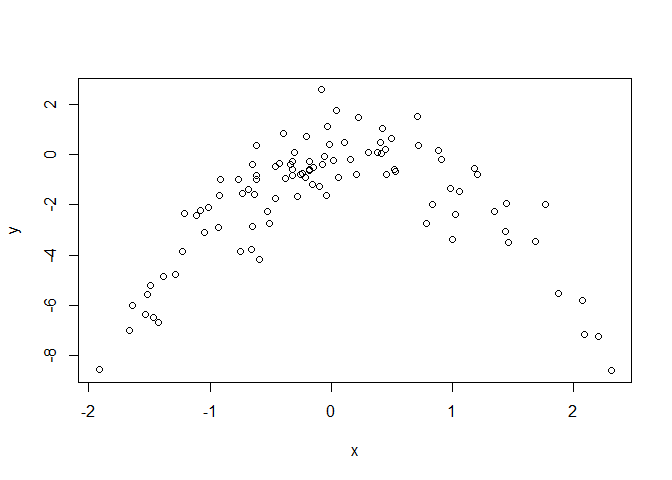

Performing cross-validation on a simulated data set.

``` r
set.seed(1)
y = rnorm(100)
x = rnorm(100)
y = x-2 * x^2 + rnorm(100)
```

n = 100 p = 2

Y = (X-2)(X^2) + epsilon

``` r
plot(x, y)
```



Quadratic plot. *X* from about -2 to 2. *Y* from about -8 to 2

``` r
set.seed(1)
library(boot)
data = data.frame(x, y)

#i
glm.fit = glm(y ~ x)
cv.glm(data, glm.fit)$delta
```

    ## [1] 5.890979 5.888812

``` r
#ii
glm.fit = glm(y ~ poly(x, 2))
cv.glm(data, glm.fit)$delta
```

    ## [1] 1.086596 1.086326

``` r
#iii
glm.fit = glm(y ~ poly(x, 3))
cv.glm(data, glm.fit)$delta
```

    ## [1] 1.102585 1.102227

``` r
#iv
glm.fit = glm(y ~ poly(x, 4))
cv.glm(data, glm.fit)$delta
```

    ## [1] 1.114772 1.114334

Repeating same with different seed value.

``` r
set.seed(100)
glm.fit = glm(y ~ x)
cv.glm(data, glm.fit)$delta
```

    ## [1] 5.890979 5.888812

``` r
glm.fit = glm(y ~ poly(x, 2))
cv.glm(data, glm.fit)$delta
```

    ## [1] 1.086596 1.086326

``` r
glm.fit = glm(y ~ poly(x, 3))
cv.glm(data, glm.fit)$delta
```

    ## [1] 1.102585 1.102227

``` r
glm.fit = glm(y ~ poly(x, 4))
cv.glm(data, glm.fit)$delta
```

    ## [1] 1.114772 1.114334

Exact same, because LOOCV will be the same since it evaluates n folds of a single observation.

The quadratic polynomial had the lowest LOOCV test error rate. This was expected because it matches the true form of *Y*

``` r
summary(glm.fit)
```

    ## 
    ## Call:
    ## glm(formula = y ~ poly(x, 4))
    ## 
    ## Deviance Residuals: 
    ##     Min       1Q   Median       3Q      Max  
    ## -2.8914  -0.5244   0.0749   0.5932   2.7796  
    ## 
    ## Coefficients:
    ##             Estimate Std. Error t value Pr(>|t|)    
    ## (Intercept)  -1.8277     0.1041 -17.549   <2e-16 ***
    ## poly(x, 4)1   2.3164     1.0415   2.224   0.0285 *  
    ## poly(x, 4)2 -21.0586     1.0415 -20.220   <2e-16 ***
    ## poly(x, 4)3  -0.3048     1.0415  -0.293   0.7704    
    ## poly(x, 4)4  -0.4926     1.0415  -0.473   0.6373    
    ## ---
    ## Signif. codes:  0 '***' 0.001 '**' 0.01 '*' 0.05 '.' 0.1 ' ' 1
    ## 
    ## (Dispersion parameter for gaussian family taken to be 1.084654)
    ## 
    ##     Null deviance: 552.21  on 99  degrees of freedom
    ## Residual deviance: 103.04  on 95  degrees of freedom
    ## AIC: 298.78
    ## 
    ## Number of Fisher Scoring iterations: 2

p-values show statistical significance of linear and quadratic terms, which agrees with the CV results.
