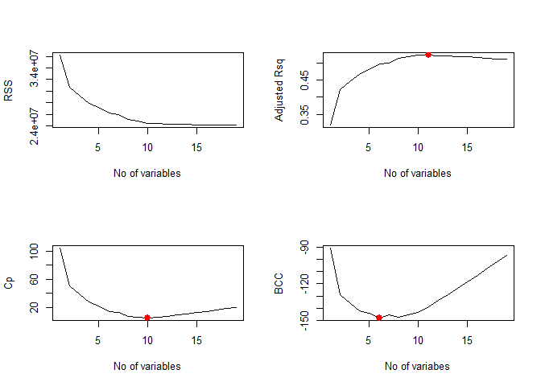
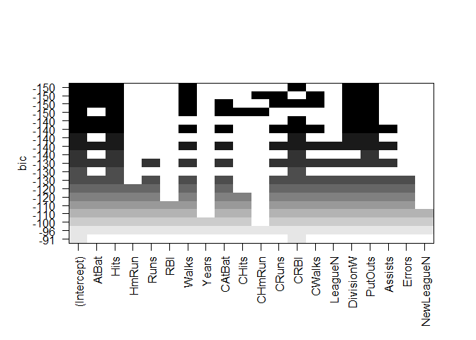
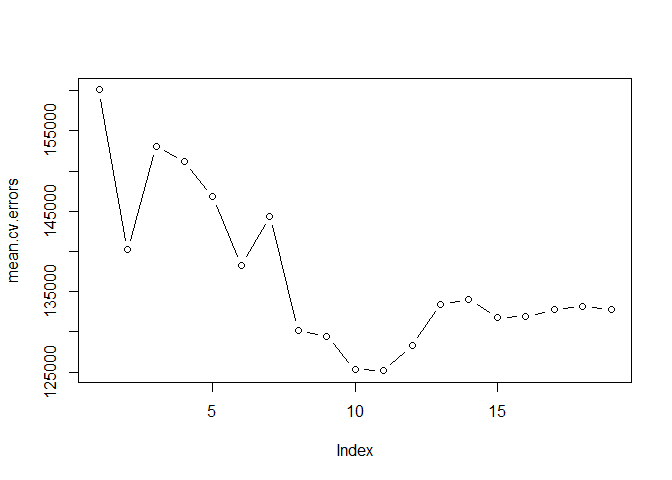

Applying the best subset selection approach to the Hitters data. We wish to predict a baseball player’s Salary on the basis of various statistics associated with performance in the previous year.

``` r
options(warn = -1)
library(ISLR)
names(Hitters)
```

    ##  [1] "AtBat"     "Hits"      "HmRun"     "Runs"      "RBI"      
    ##  [6] "Walks"     "Years"     "CAtBat"    "CHits"     "CHmRun"   
    ## [11] "CRuns"     "CRBI"      "CWalks"    "League"    "Division" 
    ## [16] "PutOuts"   "Assists"   "Errors"    "Salary"    "NewLeague"

``` r
dim(Hitters)
```

    ## [1] 322  20

``` r
sum(is.na(Hitters$Salary))
```

    ## [1] 59

Here `salary` is missing for 59 players. use `na.omit` to remove all the rows that have missing value.

``` r
Hitters = na.omit(Hitters)
dim(Hitters)
```

    ## [1] 263  20

``` r
sum(is.na(Hitters$Salary))
```

    ## [1] 0

The `regsubsets()` function (part of the `leaps` library) performs best subset selection by identifying the best model that contains a given number of predictors, where best is quantified using RSS.

``` r
library(leaps)
regfit.full = regsubsets(Salary ~ .,Hitters)
summary(regfit.full)
```

    ## Subset selection object
    ## Call: regsubsets.formula(Salary ~ ., Hitters)
    ## 19 Variables  (and intercept)
    ##            Forced in Forced out
    ## AtBat          FALSE      FALSE
    ## Hits           FALSE      FALSE
    ## HmRun          FALSE      FALSE
    ## Runs           FALSE      FALSE
    ## RBI            FALSE      FALSE
    ## Walks          FALSE      FALSE
    ## Years          FALSE      FALSE
    ## CAtBat         FALSE      FALSE
    ## CHits          FALSE      FALSE
    ## CHmRun         FALSE      FALSE
    ## CRuns          FALSE      FALSE
    ## CRBI           FALSE      FALSE
    ## CWalks         FALSE      FALSE
    ## LeagueN        FALSE      FALSE
    ## DivisionW      FALSE      FALSE
    ## PutOuts        FALSE      FALSE
    ## Assists        FALSE      FALSE
    ## Errors         FALSE      FALSE
    ## NewLeagueN     FALSE      FALSE
    ## 1 subsets of each size up to 8
    ## Selection Algorithm: exhaustive
    ##          AtBat Hits HmRun Runs RBI Walks Years CAtBat CHits CHmRun CRuns
    ## 1  ( 1 ) " "   " "  " "   " "  " " " "   " "   " "    " "   " "    " "  
    ## 2  ( 1 ) " "   "*"  " "   " "  " " " "   " "   " "    " "   " "    " "  
    ## 3  ( 1 ) " "   "*"  " "   " "  " " " "   " "   " "    " "   " "    " "  
    ## 4  ( 1 ) " "   "*"  " "   " "  " " " "   " "   " "    " "   " "    " "  
    ## 5  ( 1 ) "*"   "*"  " "   " "  " " " "   " "   " "    " "   " "    " "  
    ## 6  ( 1 ) "*"   "*"  " "   " "  " " "*"   " "   " "    " "   " "    " "  
    ## 7  ( 1 ) " "   "*"  " "   " "  " " "*"   " "   "*"    "*"   "*"    " "  
    ## 8  ( 1 ) "*"   "*"  " "   " "  " " "*"   " "   " "    " "   "*"    "*"  
    ##          CRBI CWalks LeagueN DivisionW PutOuts Assists Errors NewLeagueN
    ## 1  ( 1 ) "*"  " "    " "     " "       " "     " "     " "    " "       
    ## 2  ( 1 ) "*"  " "    " "     " "       " "     " "     " "    " "       
    ## 3  ( 1 ) "*"  " "    " "     " "       "*"     " "     " "    " "       
    ## 4  ( 1 ) "*"  " "    " "     "*"       "*"     " "     " "    " "       
    ## 5  ( 1 ) "*"  " "    " "     "*"       "*"     " "     " "    " "       
    ## 6  ( 1 ) "*"  " "    " "     "*"       "*"     " "     " "    " "       
    ## 7  ( 1 ) " "  " "    " "     "*"       "*"     " "     " "    " "       
    ## 8  ( 1 ) " "  "*"    " "     "*"       "*"     " "     " "    " "

An asterisk indicates that given variable is included in model. For ex best two-variable model contains only `Hits` and `CRBI`

By default `regsubsets` only reports variable upto 8 variable model. use `nvmax` to return as many variables as desired.

``` r
regfit.full = regsubsets(Salary ~ ., Hitters, nvmax = 19)
reg.summary = summary(regfit.full)
```

R2 statistic

``` r
reg.summary$rsq
```

    ##  [1] 0.3214501 0.4252237 0.4514294 0.4754067 0.4908036 0.5087146 0.5141227
    ##  [8] 0.5285569 0.5346124 0.5404950 0.5426153 0.5436302 0.5444570 0.5452164
    ## [15] 0.5454692 0.5457656 0.5459518 0.5460945 0.5461159

R2 statistic increases from 32% when only one variable included to almost 55% when all the variables are included.

Plotting RSS, adjusted R2, Cp, and BIC for all of the models at once will help us decide which model to select.

``` r
par(mfrow = c(2,2))
plot(reg.summary$rss, xlab = "No of variables", ylab = "RSS", type="l")  #type="l"  to connect the plotted points with lines.

plot(reg.summary$adjr2, xlab = "No of variables", ylab = "Adjusted Rsq", type="l")
#which.max(reg.summary$adjr2) location of max point in vector => 11
points(11, reg.summary$adjr2[11], col = 'red', cex = 2, pch = 20)

plot(reg.summary$cp, xlab = "No of variables", ylab = "Cp", type = 'l')
#which.min(reg.summary$cp ) => 10
points(10, reg.summary$cp[10], col = "red", cex = 2, pch = 20)

plot(reg.summary$bic, xlab = "No of variabes", ylab = "BCC", type = 'l')
#which.min(reg.summary$bic ) => 6
points(6, reg.summary$bic[6], col = "red", cex = 2, pch = 20)
```



``` r
plot(regfit.full ,scale="r2")
```


``` r
plot(regfit.full ,scale="adjr2")
```


``` r
plot(regfit.full ,scale="Cp")
```


``` r
plot(regfit.full ,scale="bic")
```



the modelwith lowest BIC contains 6 variables. to find coeficients,

``` r
coef(regfit.full, 6)
```

    ##  (Intercept)        AtBat         Hits        Walks         CRBI 
    ##   91.5117981   -1.8685892    7.6043976    3.6976468    0.6430169 
    ##    DivisionW      PutOuts 
    ## -122.9515338    0.2643076

------------------------------------------------------------------------

Forward and Backward Stepwise Selection

------------------------------------------------------------------------

``` r
regfit.fwd = regsubsets(Salary ~ ., data = Hitters, nvmax = 19, method = "forward")
summary(regfit.fwd)
```

    ## Subset selection object
    ## Call: regsubsets.formula(Salary ~ ., data = Hitters, nvmax = 19, method = "forward")
    ## 19 Variables  (and intercept)
    ##            Forced in Forced out
    ## AtBat          FALSE      FALSE
    ## Hits           FALSE      FALSE
    ## HmRun          FALSE      FALSE
    ## Runs           FALSE      FALSE
    ## RBI            FALSE      FALSE
    ## Walks          FALSE      FALSE
    ## Years          FALSE      FALSE
    ## CAtBat         FALSE      FALSE
    ## CHits          FALSE      FALSE
    ## CHmRun         FALSE      FALSE
    ## CRuns          FALSE      FALSE
    ## CRBI           FALSE      FALSE
    ## CWalks         FALSE      FALSE
    ## LeagueN        FALSE      FALSE
    ## DivisionW      FALSE      FALSE
    ## PutOuts        FALSE      FALSE
    ## Assists        FALSE      FALSE
    ## Errors         FALSE      FALSE
    ## NewLeagueN     FALSE      FALSE
    ## 1 subsets of each size up to 19
    ## Selection Algorithm: forward
    ##           AtBat Hits HmRun Runs RBI Walks Years CAtBat CHits CHmRun CRuns
    ## 1  ( 1 )  " "   " "  " "   " "  " " " "   " "   " "    " "   " "    " "  
    ## 2  ( 1 )  " "   "*"  " "   " "  " " " "   " "   " "    " "   " "    " "  
    ## 3  ( 1 )  " "   "*"  " "   " "  " " " "   " "   " "    " "   " "    " "  
    ## 4  ( 1 )  " "   "*"  " "   " "  " " " "   " "   " "    " "   " "    " "  
    ## 5  ( 1 )  "*"   "*"  " "   " "  " " " "   " "   " "    " "   " "    " "  
    ## 6  ( 1 )  "*"   "*"  " "   " "  " " "*"   " "   " "    " "   " "    " "  
    ## 7  ( 1 )  "*"   "*"  " "   " "  " " "*"   " "   " "    " "   " "    " "  
    ## 8  ( 1 )  "*"   "*"  " "   " "  " " "*"   " "   " "    " "   " "    "*"  
    ## 9  ( 1 )  "*"   "*"  " "   " "  " " "*"   " "   "*"    " "   " "    "*"  
    ## 10  ( 1 ) "*"   "*"  " "   " "  " " "*"   " "   "*"    " "   " "    "*"  
    ## 11  ( 1 ) "*"   "*"  " "   " "  " " "*"   " "   "*"    " "   " "    "*"  
    ## 12  ( 1 ) "*"   "*"  " "   "*"  " " "*"   " "   "*"    " "   " "    "*"  
    ## 13  ( 1 ) "*"   "*"  " "   "*"  " " "*"   " "   "*"    " "   " "    "*"  
    ## 14  ( 1 ) "*"   "*"  "*"   "*"  " " "*"   " "   "*"    " "   " "    "*"  
    ## 15  ( 1 ) "*"   "*"  "*"   "*"  " " "*"   " "   "*"    "*"   " "    "*"  
    ## 16  ( 1 ) "*"   "*"  "*"   "*"  "*" "*"   " "   "*"    "*"   " "    "*"  
    ## 17  ( 1 ) "*"   "*"  "*"   "*"  "*" "*"   " "   "*"    "*"   " "    "*"  
    ## 18  ( 1 ) "*"   "*"  "*"   "*"  "*" "*"   "*"   "*"    "*"   " "    "*"  
    ## 19  ( 1 ) "*"   "*"  "*"   "*"  "*" "*"   "*"   "*"    "*"   "*"    "*"  
    ##           CRBI CWalks LeagueN DivisionW PutOuts Assists Errors NewLeagueN
    ## 1  ( 1 )  "*"  " "    " "     " "       " "     " "     " "    " "       
    ## 2  ( 1 )  "*"  " "    " "     " "       " "     " "     " "    " "       
    ## 3  ( 1 )  "*"  " "    " "     " "       "*"     " "     " "    " "       
    ## 4  ( 1 )  "*"  " "    " "     "*"       "*"     " "     " "    " "       
    ## 5  ( 1 )  "*"  " "    " "     "*"       "*"     " "     " "    " "       
    ## 6  ( 1 )  "*"  " "    " "     "*"       "*"     " "     " "    " "       
    ## 7  ( 1 )  "*"  "*"    " "     "*"       "*"     " "     " "    " "       
    ## 8  ( 1 )  "*"  "*"    " "     "*"       "*"     " "     " "    " "       
    ## 9  ( 1 )  "*"  "*"    " "     "*"       "*"     " "     " "    " "       
    ## 10  ( 1 ) "*"  "*"    " "     "*"       "*"     "*"     " "    " "       
    ## 11  ( 1 ) "*"  "*"    "*"     "*"       "*"     "*"     " "    " "       
    ## 12  ( 1 ) "*"  "*"    "*"     "*"       "*"     "*"     " "    " "       
    ## 13  ( 1 ) "*"  "*"    "*"     "*"       "*"     "*"     "*"    " "       
    ## 14  ( 1 ) "*"  "*"    "*"     "*"       "*"     "*"     "*"    " "       
    ## 15  ( 1 ) "*"  "*"    "*"     "*"       "*"     "*"     "*"    " "       
    ## 16  ( 1 ) "*"  "*"    "*"     "*"       "*"     "*"     "*"    " "       
    ## 17  ( 1 ) "*"  "*"    "*"     "*"       "*"     "*"     "*"    "*"       
    ## 18  ( 1 ) "*"  "*"    "*"     "*"       "*"     "*"     "*"    "*"       
    ## 19  ( 1 ) "*"  "*"    "*"     "*"       "*"     "*"     "*"    "*"

``` r
regfit.bwd = regsubsets(Salary ~ ., data = Hitters, nvmax = 19, method = "backward")
summary(regfit.bwd)
```

    ## Subset selection object
    ## Call: regsubsets.formula(Salary ~ ., data = Hitters, nvmax = 19, method = "backward")
    ## 19 Variables  (and intercept)
    ##            Forced in Forced out
    ## AtBat          FALSE      FALSE
    ## Hits           FALSE      FALSE
    ## HmRun          FALSE      FALSE
    ## Runs           FALSE      FALSE
    ## RBI            FALSE      FALSE
    ## Walks          FALSE      FALSE
    ## Years          FALSE      FALSE
    ## CAtBat         FALSE      FALSE
    ## CHits          FALSE      FALSE
    ## CHmRun         FALSE      FALSE
    ## CRuns          FALSE      FALSE
    ## CRBI           FALSE      FALSE
    ## CWalks         FALSE      FALSE
    ## LeagueN        FALSE      FALSE
    ## DivisionW      FALSE      FALSE
    ## PutOuts        FALSE      FALSE
    ## Assists        FALSE      FALSE
    ## Errors         FALSE      FALSE
    ## NewLeagueN     FALSE      FALSE
    ## 1 subsets of each size up to 19
    ## Selection Algorithm: backward
    ##           AtBat Hits HmRun Runs RBI Walks Years CAtBat CHits CHmRun CRuns
    ## 1  ( 1 )  " "   " "  " "   " "  " " " "   " "   " "    " "   " "    "*"  
    ## 2  ( 1 )  " "   "*"  " "   " "  " " " "   " "   " "    " "   " "    "*"  
    ## 3  ( 1 )  " "   "*"  " "   " "  " " " "   " "   " "    " "   " "    "*"  
    ## 4  ( 1 )  "*"   "*"  " "   " "  " " " "   " "   " "    " "   " "    "*"  
    ## 5  ( 1 )  "*"   "*"  " "   " "  " " "*"   " "   " "    " "   " "    "*"  
    ## 6  ( 1 )  "*"   "*"  " "   " "  " " "*"   " "   " "    " "   " "    "*"  
    ## 7  ( 1 )  "*"   "*"  " "   " "  " " "*"   " "   " "    " "   " "    "*"  
    ## 8  ( 1 )  "*"   "*"  " "   " "  " " "*"   " "   " "    " "   " "    "*"  
    ## 9  ( 1 )  "*"   "*"  " "   " "  " " "*"   " "   "*"    " "   " "    "*"  
    ## 10  ( 1 ) "*"   "*"  " "   " "  " " "*"   " "   "*"    " "   " "    "*"  
    ## 11  ( 1 ) "*"   "*"  " "   " "  " " "*"   " "   "*"    " "   " "    "*"  
    ## 12  ( 1 ) "*"   "*"  " "   "*"  " " "*"   " "   "*"    " "   " "    "*"  
    ## 13  ( 1 ) "*"   "*"  " "   "*"  " " "*"   " "   "*"    " "   " "    "*"  
    ## 14  ( 1 ) "*"   "*"  "*"   "*"  " " "*"   " "   "*"    " "   " "    "*"  
    ## 15  ( 1 ) "*"   "*"  "*"   "*"  " " "*"   " "   "*"    "*"   " "    "*"  
    ## 16  ( 1 ) "*"   "*"  "*"   "*"  "*" "*"   " "   "*"    "*"   " "    "*"  
    ## 17  ( 1 ) "*"   "*"  "*"   "*"  "*" "*"   " "   "*"    "*"   " "    "*"  
    ## 18  ( 1 ) "*"   "*"  "*"   "*"  "*" "*"   "*"   "*"    "*"   " "    "*"  
    ## 19  ( 1 ) "*"   "*"  "*"   "*"  "*" "*"   "*"   "*"    "*"   "*"    "*"  
    ##           CRBI CWalks LeagueN DivisionW PutOuts Assists Errors NewLeagueN
    ## 1  ( 1 )  " "  " "    " "     " "       " "     " "     " "    " "       
    ## 2  ( 1 )  " "  " "    " "     " "       " "     " "     " "    " "       
    ## 3  ( 1 )  " "  " "    " "     " "       "*"     " "     " "    " "       
    ## 4  ( 1 )  " "  " "    " "     " "       "*"     " "     " "    " "       
    ## 5  ( 1 )  " "  " "    " "     " "       "*"     " "     " "    " "       
    ## 6  ( 1 )  " "  " "    " "     "*"       "*"     " "     " "    " "       
    ## 7  ( 1 )  " "  "*"    " "     "*"       "*"     " "     " "    " "       
    ## 8  ( 1 )  "*"  "*"    " "     "*"       "*"     " "     " "    " "       
    ## 9  ( 1 )  "*"  "*"    " "     "*"       "*"     " "     " "    " "       
    ## 10  ( 1 ) "*"  "*"    " "     "*"       "*"     "*"     " "    " "       
    ## 11  ( 1 ) "*"  "*"    "*"     "*"       "*"     "*"     " "    " "       
    ## 12  ( 1 ) "*"  "*"    "*"     "*"       "*"     "*"     " "    " "       
    ## 13  ( 1 ) "*"  "*"    "*"     "*"       "*"     "*"     "*"    " "       
    ## 14  ( 1 ) "*"  "*"    "*"     "*"       "*"     "*"     "*"    " "       
    ## 15  ( 1 ) "*"  "*"    "*"     "*"       "*"     "*"     "*"    " "       
    ## 16  ( 1 ) "*"  "*"    "*"     "*"       "*"     "*"     "*"    " "       
    ## 17  ( 1 ) "*"  "*"    "*"     "*"       "*"     "*"     "*"    "*"       
    ## 18  ( 1 ) "*"  "*"    "*"     "*"       "*"     "*"     "*"    "*"       
    ## 19  ( 1 ) "*"  "*"    "*"     "*"       "*"     "*"     "*"    "*"

we see that using forward stepwise selection, the best one variable model contains only `CRBI`, and the best two-variable model additionally includes `Hits`. For this data, the best one-variable through six variable models are each identical for best subset and forward selection. However, the best seven-variable models identified by forward stepwise selection, backward stepwise selection, and best subset selection are different.

``` r
coef(regfit.full, 7)
```

    ##  (Intercept)         Hits        Walks       CAtBat        CHits 
    ##   79.4509472    1.2833513    3.2274264   -0.3752350    1.4957073 
    ##       CHmRun    DivisionW      PutOuts 
    ##    1.4420538 -129.9866432    0.2366813

``` r
coef(regfit.fwd, 7)
```

    ##  (Intercept)        AtBat         Hits        Walks         CRBI 
    ##  109.7873062   -1.9588851    7.4498772    4.9131401    0.8537622 
    ##       CWalks    DivisionW      PutOuts 
    ##   -0.3053070 -127.1223928    0.2533404

``` r
coef(regfit.bwd, 7)
```

    ##  (Intercept)        AtBat         Hits        Walks        CRuns 
    ##  105.6487488   -1.9762838    6.7574914    6.0558691    1.1293095 
    ##       CWalks    DivisionW      PutOuts 
    ##   -0.7163346 -116.1692169    0.3028847

################################################################################################################## 

choosing models using validation and cross-validation set approach.

################################################################################################################## 

first divide dataset into trainig and testing

``` r
set.seed(1)
train = sample(c(TRUE, FALSE), nrow(Hitters), rep = TRUE)
test = !train
```

then apply `regsubsets` using only training data.

``` r
regfit.best = regsubsets(Salary ~ ., data = Hitters[train,], nvmax = 19)
coef(regfit.best, 10)
```

    ## (Intercept)       AtBat        Hits       Walks      CAtBat       CHits 
    ## -80.2751499  -1.4683816   7.1625314   3.6430345  -0.1855698   1.1053238 
    ##      CHmRun      CWalks     LeagueN   DivisionW     PutOuts 
    ##   1.3844863  -0.7483170  84.5576103 -53.0289658   0.2381662

We now compute the validation set error for the best model of each model size. We first make a model matrix from the test data.

``` r
test.mat = model.matrix(Salary ~., data = Hitters[test,])
```

Now we run a loop, and for each size i, we extract the coefficients from `regfit.best` for the best model of that size, multiply them into the appropriate columns of the test model matrix to form the predictions, and compute the test MSE.

``` r
predict.regsubsets = function(object, newData, id, ...){
  form = as.formula(object$call[[2]])
  mat = model.matrix(form, newData)
  coefi = coef(object, id = id)
  xvars = names(coefi)
  mat[,xvars]%*%coefi
}
```

``` r
regfit.best = regsubsets(Salary ~., data = Hitters, nvmax = 19)
coef(regfit.best, 10)
```

    ##  (Intercept)        AtBat         Hits        Walks       CAtBat 
    ##  162.5354420   -2.1686501    6.9180175    5.7732246   -0.1300798 
    ##        CRuns         CRBI       CWalks    DivisionW      PutOuts 
    ##    1.4082490    0.7743122   -0.8308264 -112.3800575    0.2973726 
    ##      Assists 
    ##    0.2831680

Using full dataset provide diffrent coefficients for 10 variable model than using just training dataset.We now try to choose among the models of different sizes using crossvalidation. First, we create a vector that allocates each observation to one of k = 10 folds, and we create a matrix in which we will store the results.

``` r
k = 10
set.seed(1)
folds = sample(1:k, nrow(Hitters), replace = T)
cv.errors = matrix(NA, k, 19, dimnames = list(NULL, paste(1:19)))
```

Now we write a for loop that performs cross-validation. In the jth fold, the elements of folds that equal j are in the test set, and the remainder are in the training set.

``` r
for(j in 1:k){
  best.fit = regsubsets(Salary ~ ., data = Hitters[folds != j,], nvmax = 19)
  for(i in 1:19){
    pred = predict(best.fit, Hitters[folds == j,], id = i)
    cv.errors[j, i] = mean((Hitters$Salary[folds == j] - pred)^2)
  }
}
```

This has given us a 10×19 matrix, of which the (i,j)th element corresponds to the test MSE for the ith cross-validation fold for the best j-variable model.We use the `apply()` function to average over the columns of this matrix in order to obtain a vector for which the jth element is the crossvalidation error for the j-variable model.

``` r
mean.cv.errors = apply(cv.errors, 2, mean)
mean.cv.errors
```

    ##        1        2        3        4        5        6        7        8 
    ## 160093.5 140196.8 153117.0 151159.3 146841.3 138302.6 144346.2 130207.7 
    ##        9       10       11       12       13       14       15       16 
    ## 129459.6 125334.7 125153.8 128273.5 133461.0 133974.6 131825.7 131882.8 
    ##       17       18       19 
    ## 132750.9 133096.2 132804.7

``` r
par(mfrow = c(1,1))
plot(mean.cv.errors, type = 'b')
```

 We see that cross-validation selects an 11-variable model. We now perform best subset selection on the full data set in order to obtain the 11-variable model.

``` r
reg.best = regsubsets(Salary ~ .,data = Hitters, nvmax = 19)
coef(reg.best, 11)
```

    ##  (Intercept)        AtBat         Hits        Walks       CAtBat 
    ##  135.7512195   -2.1277482    6.9236994    5.6202755   -0.1389914 
    ##        CRuns         CRBI       CWalks      LeagueN    DivisionW 
    ##    1.4553310    0.7852528   -0.8228559   43.1116152 -111.1460252 
    ##      PutOuts      Assists 
    ##    0.2894087    0.2688277
